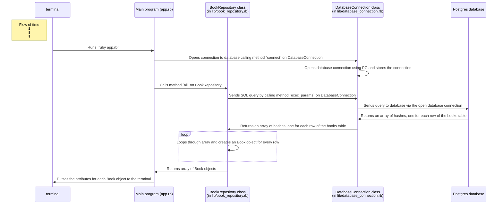

# Challenge

Create a sequence diagram to show the book store challenge from the previous section.

Answer:

```mermaid
sequenceDiagram
    participant t as terminal
    participant app as Main program (app.rb)
    participant ar as BookRepository class <br /> (in lib/book_repository.rb)
    participant db_conn as DatabaseConnection class <br /> (in lib/database_connection.rb)
    participant db as Postgres database

    Note left of t: Flow of time <br />⬇ <br /> ⬇ <br /> ⬇ 

    t->>app: Runs `ruby app.rb`
    app->>db_conn: Opens connection to database calling method `connect` on DatabaseConnection
    db_conn->>db_conn: Opens database connection using PG and stores the connection
    app->>ar: Calls method `all` on BookRepository
    ar->>db_conn: Sends SQL query by calling method `exec_params` on DatabaseConnection
    db_conn->>db: Sends query to database via the open database connection
    db->>db_conn: Returns an array of hashes, one for each row of the books table

    db_conn->>ar: Returns an array of hashes, one for each row of the books table
    loop 
        ar->>ar: Loops through array and creates an Book object for every row
    end
    ar->>app: Returns array of Book objects
    app->>t: Putses the attributes for each Book object to the terminal
```
